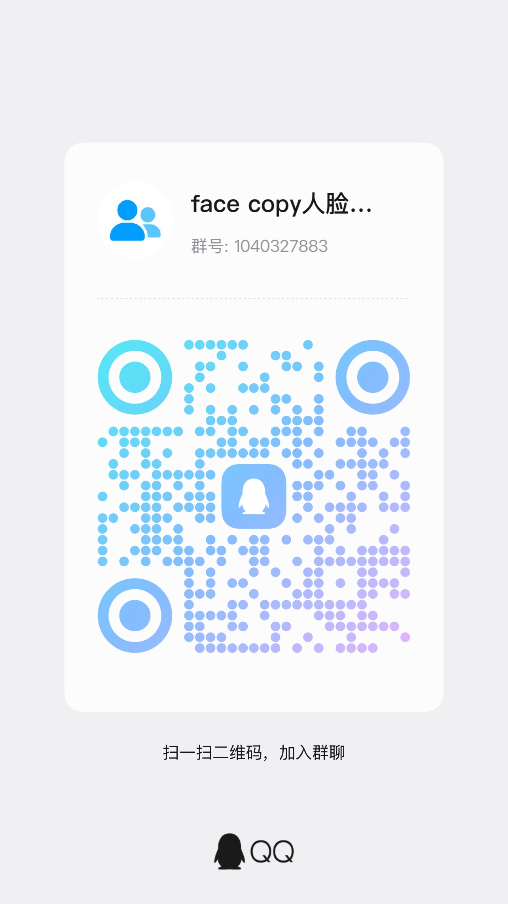

# Face Swap Pipeline

一个面向本地推理的人脸替换项目，支持两种使用方式：
- Notebook 交互式流程: face_swap_pipeline.ipynb
- 命令行一键流程: face_swap.py

核心流程:
FFmpeg 抽帧 -> InsightFace 检测 -> Inswapper 推理 -> GFPGAN 修复 -> 颜色匹配 -> FFmpeg 编码 -> 输出 MP4

## 1. 项目特点

- 支持单图到视频的人脸替换
- 支持多人脸目标帧逐脸替换
- 可选 GFPGAN 人脸修复增强
- 可选 LAB 颜色匹配，减少换脸后色差
- 可选保留中间帧，便于排查与对比

## 2. 环境要求

- macOS / Linux / Windows
- Python 3.10（推荐）
- FFmpeg 与 ffprobe 可执行文件放在项目当前目录

检查当前目录中的可执行文件:

```bash
ffmpeg -version
ffprobe -version
```

目录示例:

```text
faceCopy/
├── ffmpeg
├── ffprobe
├── face_swap.py
└── gfpgan/
    └── weights/
        ├── detection_Resnet50_Final.pth
        └── parsing_parsenet.pth
└── models/
    ├── inswapper_128.onnx
    ├── GFPGANv1.3.pth
    └── buffalo_l/
        ├── 1k3d68.onnx
        ├── 2d106det.onnx
        ├── det_10g.onnx
        ├── genderage.onnx
        └── w600k_r50.onnx    
```

## 3. 依赖库明细（已整理）

依赖定义文件: requirements.txt

### 3.1 核心深度学习
- torch==2.12.0
- torchvision==0.27.0

### 3.2 人脸检测与换脸
- insightface==1.0.1
- onnx==1.22.0
- onnxruntime==1.23.2
- 可选 GPU 版本: onnxruntime-gpu==1.23.2

### 3.3 人脸修复与增强
- basicsr==1.4.2
- facexlib==0.3.0
- gfpgan==1.3.8

### 3.4 图像与数值计算
- numpy==2.2.6
- scipy==1.15.3
- opencv-python-headless==4.13.0.92
- pillow==12.2.0
- scikit-image==0.25.2
- tqdm==4.68.2

### 3.5 Notebook 与可视化
- ipykernel==7.3.0
- ipython>=8.0.0
- matplotlib>=3.8.0

## 4. 安装方法

### 4.1 创建虚拟环境（示例）

```bash
python3.10 -m venv .venv
source .venv/bin/activate
python -m pip install --upgrade pip
```

### 4.2 安装 Python 依赖

```bash
pip install -r requirements.txt --no-build-isolation
```

### 4.3 可选：NVIDIA CUDA 环境

如果使用 NVIDIA GPU，将 onnxruntime 替换为 onnxruntime-gpu:

```bash
pip uninstall -y onnxruntime
pip install onnxruntime-gpu==1.23.2
```

## 5. 必需模型文件

请确认以下模型已在对应目录。

### 5.1 主模型目录 models/
- models/inswapper_128.onnx
- models/GFPGANv1.3.pth
- models/buffalo_l/1k3d68.onnx
- models/buffalo_l/2d106det.onnx
- models/buffalo_l/det_10g.onnx
- models/buffalo_l/genderage.onnx
- models/buffalo_l/w600k_r50.onnx

### 5.2 GFPGAN 依赖权重 gfpgan/weights/
- gfpgan/weights/detection_Resnet50_Final.pth
- gfpgan/weights/parsing_parsenet.pth

### 5.3 下载地址（models 与 GFPGAN）

官方来源建议:
- InsightFace 模型发布页: https://github.com/deepinsight/insightface/releases
- GFPGAN 模型发布页: https://github.com/TencentARC/GFPGAN/releases
- FaceXLib 模型发布页: https://github.com/xinntao/facexlib/releases

可直接下载链接:
- inswapper_128.onnx: https://github.com/deepinsight/insightface/releases/download/v0.7/inswapper_128.onnx
- buffalo_l.zip: https://github.com/deepinsight/insightface/releases/download/v0.7/buffalo_l.zip
- GFPGANv1.3.pth: https://github.com/TencentARC/GFPGAN/releases/download/v1.3.0/GFPGANv1.3.pth
- detection_Resnet50_Final.pth: https://github.com/xinntao/facexlib/releases/download/v0.1.0/detection_Resnet50_Final.pth
- parsing_parsenet.pth: https://github.com/xinntao/facexlib/releases/download/v0.2.5/parsing_parsenet.pth

下载与放置示例:

```bash
# models
mkdir -p models models/buffalo_l
curl -L -o models/inswapper_128.onnx \
  https://github.com/deepinsight/insightface/releases/download/v0.7/inswapper_128.onnx
curl -L -o models/buffalo_l.zip \
  https://github.com/deepinsight/insightface/releases/download/v0.7/buffalo_l.zip
unzip -o models/buffalo_l.zip -d models/
curl -L -o models/GFPGANv1.3.pth \
  https://github.com/TencentARC/GFPGAN/releases/download/v1.3.0/GFPGANv1.3.pth

# gfpgan/weights
mkdir -p gfpgan/weights
curl -L -o gfpgan/weights/detection_Resnet50_Final.pth \
  https://github.com/xinntao/facexlib/releases/download/v0.1.0/detection_Resnet50_Final.pth
curl -L -o gfpgan/weights/parsing_parsenet.pth \
  https://github.com/xinntao/facexlib/releases/download/v0.2.5/parsing_parsenet.pth
```

## 6. 使用方法

### 6.1 命令行运行

```bash
python face_swap.py \
  -s photo.png \
  -v video.mp4 \
  -o final_output.mp4
```

常用参数:
- --no-gfpgan: 禁用人脸修复
- --no-color-match: 禁用颜色匹配
- --gpu: 使用 GPU（ctx_id=0）
- --keep-frames: 保留中间帧
- --workdir workspace: 中间结果目录

示例（不启用 GFPGAN）:

```bash
python face_swap.py -s IMG_3897.png -v video.mp4 -o final_output_IMG_3897.mp4 --no-gfpgan
```

### 6.2 Notebook 运行

打开并顺序执行:
- face_swap_pipeline.ipynb

说明:
- Notebook 已包含 basicsr 与 torchvision 的兼容补丁单元
- 必须先运行补丁单元，再 import gfpgan

## 7. 项目结构

```text
faceCopy/
├── face_swap.py
├── face_swap_pipeline.ipynb
├── requirements.txt
├── models/
│   ├── inswapper_128.onnx
│   ├── GFPGANv1.3.pth
│   └── buffalo_l/
├── gfpgan/weights/
├── workspace/
│   ├── frames/
│   └── result_frames/
└── README.md
```

## 8. 效果展示

### 8.1 效果对比视频（指定样例）

<table>
  <tr>
    <th>原视频（换脸前）</th>
    <th>输出视频（换脸后）</th>
  </tr>
  <tr>
    <td></td>
    <td></td>
  </tr>
</table>

### 8.3 其他示例输出视频

- final_output.mp4
- final_output_IMG_3897.mp4
- final_output_pose1_20260615121036.mp4

## 9. 常见问题

1. basicsr安装不了
- 从GitHub的源代码安装

2. 源图片检测不到人脸
- 确认图片清晰、正脸、光照充足
- 尝试更高分辨率源图

3. 输出视频没有声音
- 检查输入视频是否包含音轨
- 脚本会执行 -map 1:a?，无音轨时会生成无声视频

## 10. 使用声明

请在合法、合规、获得授权的前提下使用本项目，不得用于侵权、欺诈或误导性内容制作。

## 11. 微信/QQ 讨论群二维码

说明:
- 下面已添加二维码图片位置。
- 当前为占位图，请替换为你自己的群二维码图片，保持相同文件名即可。


### QQ群二维码


